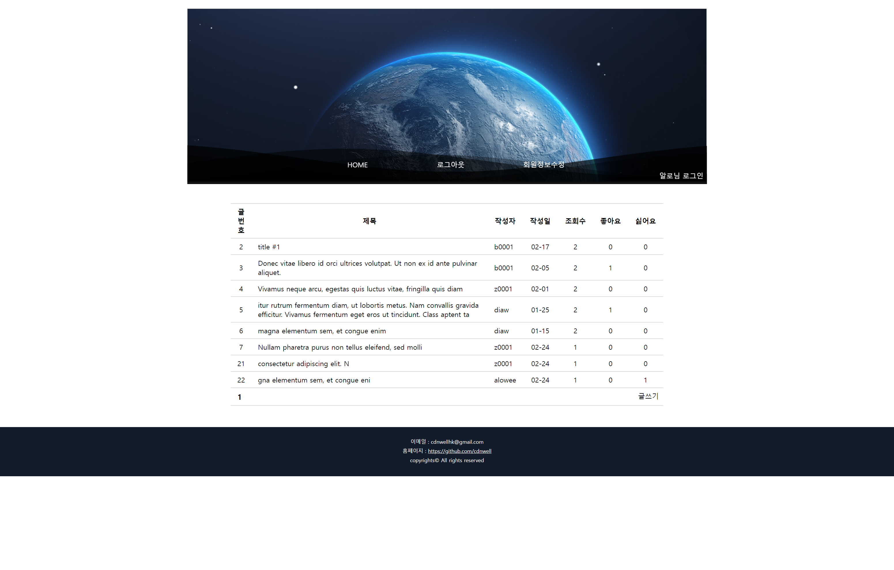

<h1>개인 프로젝트</h1>

이름 : 황상혁

이메일 : heshah@naver.com

<h2>ShopProject : 쇼핑몰</h2>

소개 : 국비지원학원 최종 팀 프로젝트입니다. 팀 프로젝트가 끝난 후 개인적으로 기능을 추가하고 코드를 다듬었습니다.

스킬 : Java(Spring MVC), jsp, JavaScript, jQuery, Html5, CSS, Oracle, Mybatis, bootstrap

<h3>코드</h3>
<a href="https://github.com/cdnwell/Portfolio/tree/master/ShopProject">옷 쇼핑몰 : 코드 링크</a>
<h3>Home</h3>
 
<h2>SpringBoardProject : 게시판</h2>

소개 : 학원 게시판 만드는 수업 때 만든 spring project를 기반으로 css를 붙이고 아이디 찾기와 같은 기능을 덧붙였습니다.

스킬 : Java(Spring MVC), jsp, JavaScript, jQuery, Html5, CSS, Oracle, Mybatis

<h3>코드</h3>
<a href="https://github.com/cdnwell/Portfolio/tree/master/SpringBoardProject_universe">게시판 : 코드 링크</a>
<h3>Home</h3>

<h2>fruitproject : 온라인 과일 쇼핑몰</h2>

소개 : 온라인 과일 쇼핑몰을 만들었습니다. 모달 창을 만들어보고 카카오 로그인, 맵, 네이버 로그인 api를 사용했습니다.

스킬 : Java(Spring MVC), jsp, JavaScript, jQuery, Html5, CSS, Oracle, Mybatis

<h3>코드</h3>
<a href="https://github.com/cdnwell/Portfolio/tree/master/fruitproject">과일 쇼핑몰 : 코드 링크</a>
<h3>Home</h3>

<h2>namweb : 리액트 & 스프링</h2>

소개 : 최근에 만든 개인 프로젝트입니다. 스카이 공사 작업 차량의 작업 예약 홈페이지입니다.

스킬 : Java(Spring), React.js, Mysql, Html5, SCSS

<h3>코드</h3>
<a href="https://github.com/cdnwell/Portfolio/tree/master/namweb">스카이 예약 사이트 : 코드 링크</a>
<h3>Home</h3>

