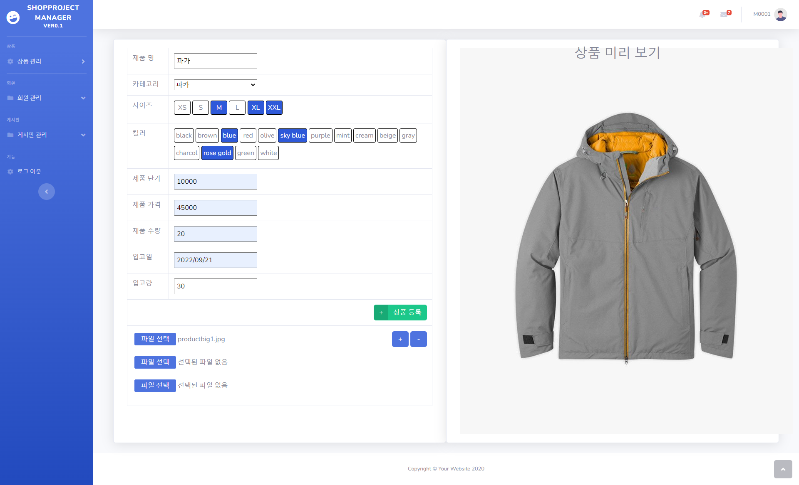

<h1> ShopProject </h1>

프로젝트 주제 : 의류 쇼핑몰

제작 기간 : 2022-09 ~ 2022-11

사용한 기술 : Java(Spring), JavaScript, jQuery, Oracle, Mysql, Mybatis, Html5, CSS, JSP, bootstrap

프로젝트 소개 : 국비지원학원에서 한 팀 프로젝트에 개인적으로 기능을 추가하고 코드를 리팩토링한 프로젝트입니다.

<h2>ERD</h2>

<h2>화면</h2>
<h3>메인 페이지</h3>

<h3>로그인</h3>

<h3>회원 가입</h3>

<h3>구매 페이지</h3>

<h3>관리자 - 회원 관리 목록</h3>

<h3>관리자 - 상품 등록</h3>

<h3>관리자 - 공지사항 글쓰기</h3>

<h3>공지사항</h3>

<h3>공지사항 목록</h3>

