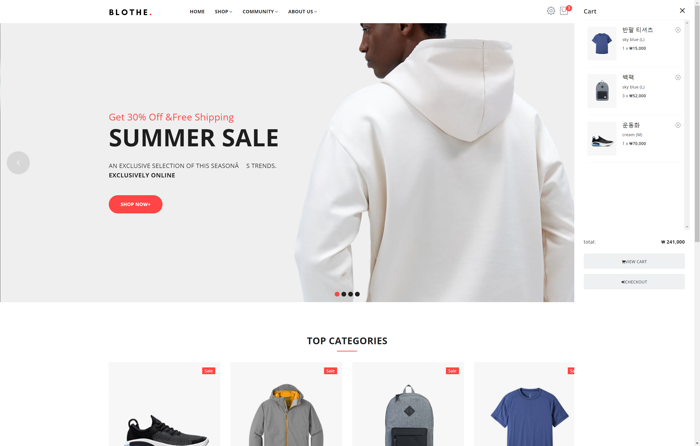

<h1> ShopProject </h1>

프로젝트 주제 : 의류 쇼핑몰

소개 : 국비지원학원에서 만든 의류 쇼핑몰 프로젝트입니다.

팀 프로젝트로 시작해 학원 수료후 개인적으로 기능을 추가하고 코드를 리팩토링하였습니다.

<h2>제작 기간</h2> 

2022-09 ~ 2022-12

<h2>기술 스택</h2>

Java(Spring), JavaScript, jQuery, Oracle, Mysql, Mybatis, Html5, CSS, JSP, bootstrap

<h2>ERD</h2>

<h2>핵심 기능</h2>
<h3>카트 담기 기능</h3>

<h4>코드</h4>
<a href="https://github.com/cdnwell/Portfolio/blob/master/ShopProject/src/main/webapp/js/cart_list.js" >카트 담기기능 코드입니다</a>
<h3>대댓글 기능</h3>

<h4>코드</h4>
<a href="https://github.com/cdnwell/Portfolio/blob/master/ShopProject/src/main/webapp/WEB-INF/views/notice_details.jsp">대댓글 데이터를 받아서 출력해주는 jsp 파일입니다.</a>
<h2>화면</h2>
<h3>메인 페이지</h3>

<h3>로그인</h3>

<h3>회원 가입</h3>

<h3>구매 페이지</h3>

<h3>관리자 - 회원 관리 목록</h3>

<h3>관리자 - 상품 등록</h3>

<h3>관리자 - 공지사항 글쓰기</h3>

<h3>공지사항</h3>

<h3>공지사항 목록</h3>

