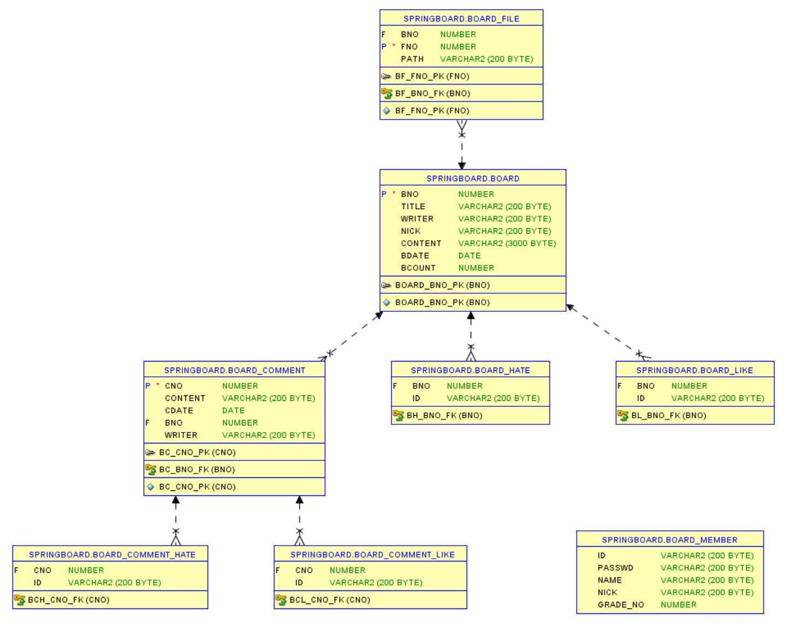
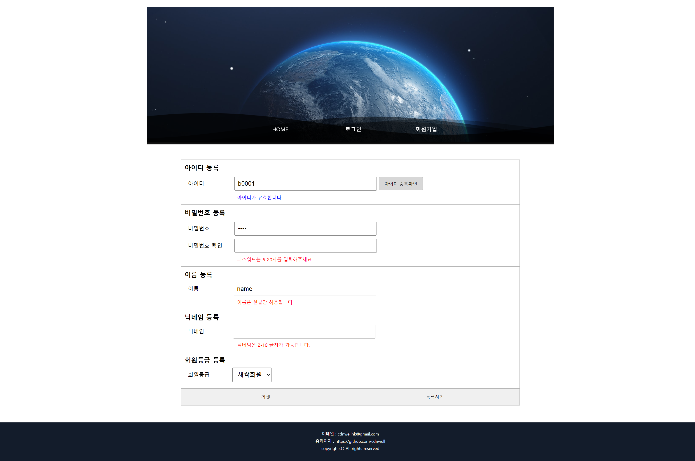
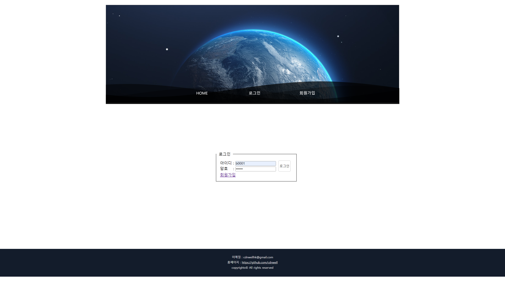
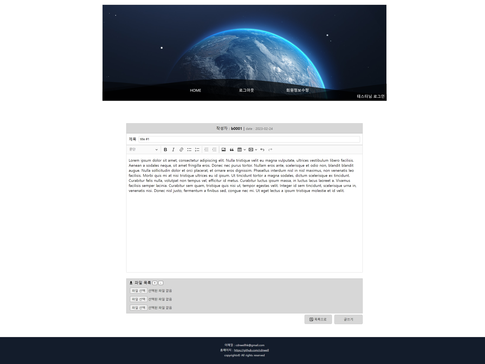

<h1>SpringBoardProject</h1>
<h2>프로젝트 소개</h2>

국비지원학원에서 게시판 만들기를 할 때 만든 개인 프로젝트입니다.

기존 css가 없던 게시판을 복습하면서 css를 추가하고 다듬었습니다.

<h2>ERD</h2>

<h2>화면</h2>
<h3>회원 가입</h3>

<h3>로그인</h3>

<h3>게시판 글쓰기</h3>

