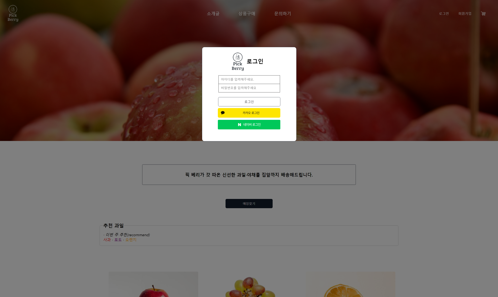
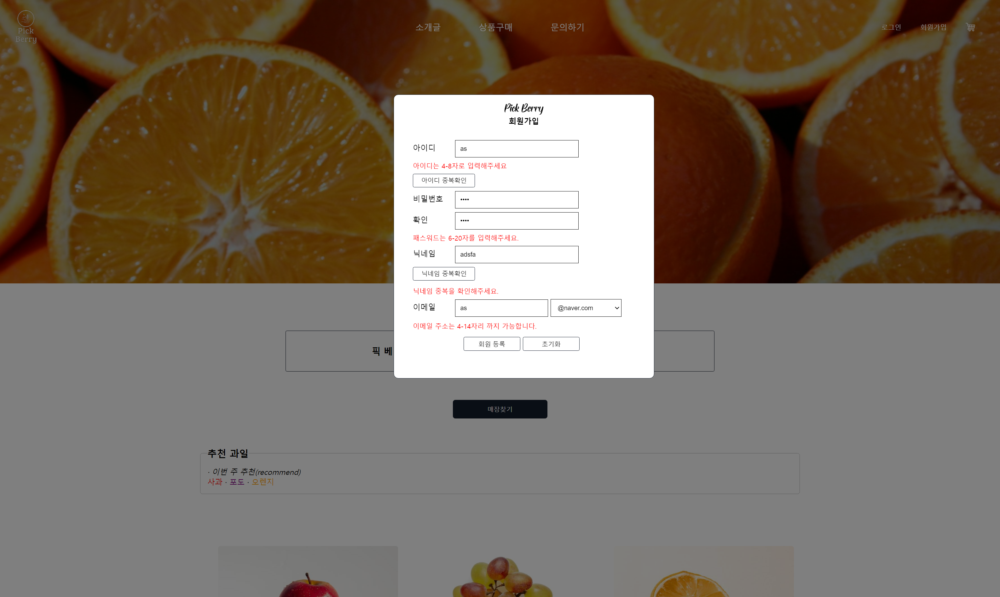

<h1>FruitProject</h1>

프로젝트 주제 : 온라인 과일 쇼핑몰

소개 : 과일 쇼핑몰 메인 페이지를 한 페이지를 만들었습니다.

한 페이지를 만들었지만 기존에 알지 못하던 지식을 활용하고 익숙하지 않았던 api를 사용해보며 일주일 정도에 걸쳐 만든 웹사이트입니다.

<h2>제작 기간</h2>

7일~

<h2>기술 스택</h2>

Java(Spring MVC), JavaScript, jQuery, Html5, CSS, Oracle, Mybatis

<h2>화면</h2>
<h3>메인 페이지</h3>

<h3>로그인 : 모달</h3>

<h3>회원가입 : 모달</h3>

