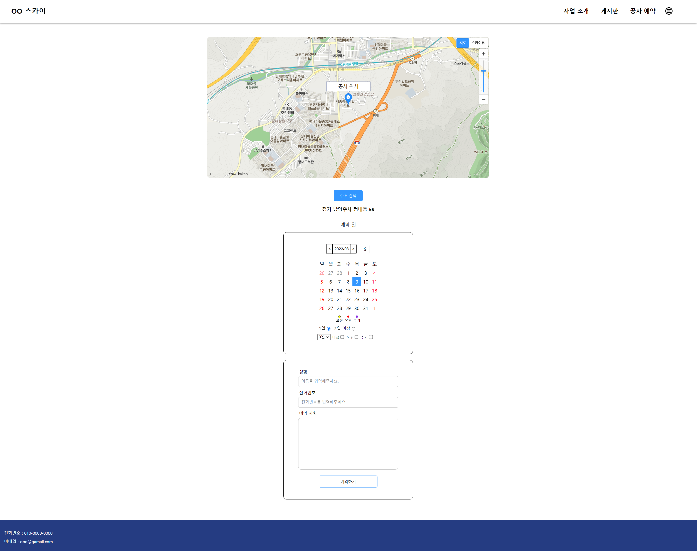
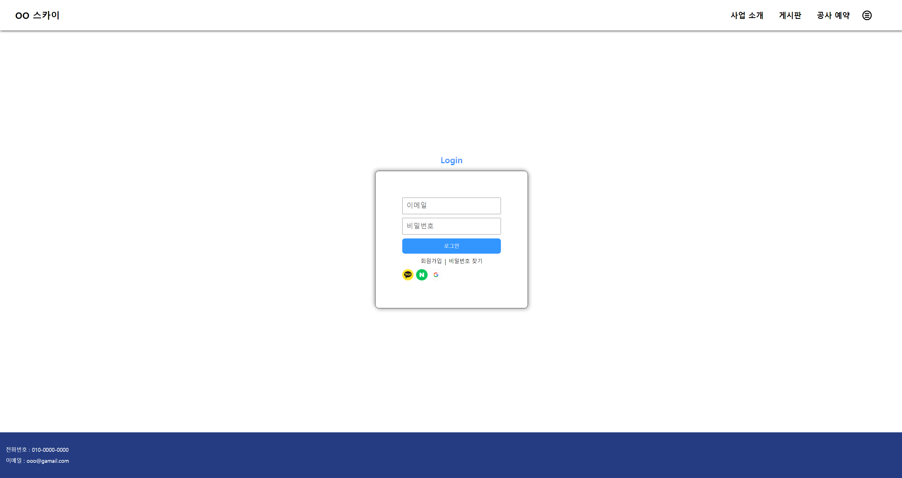
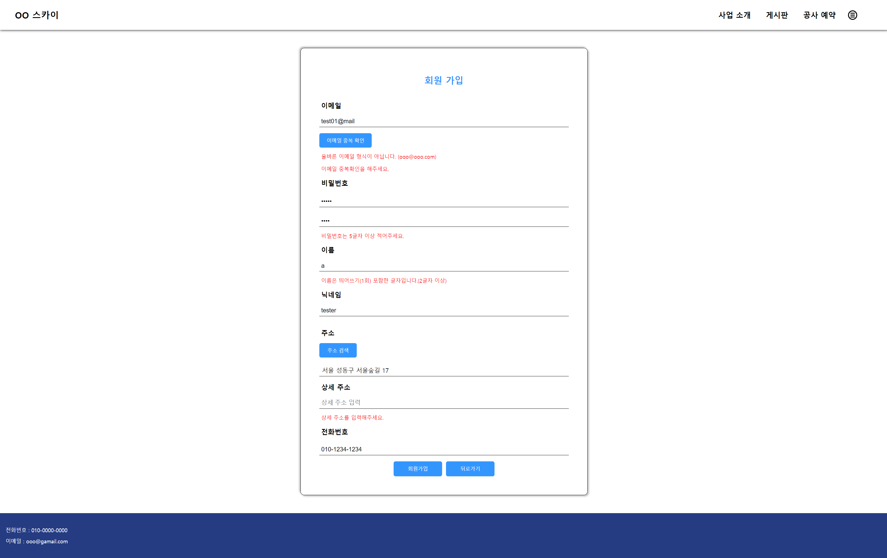
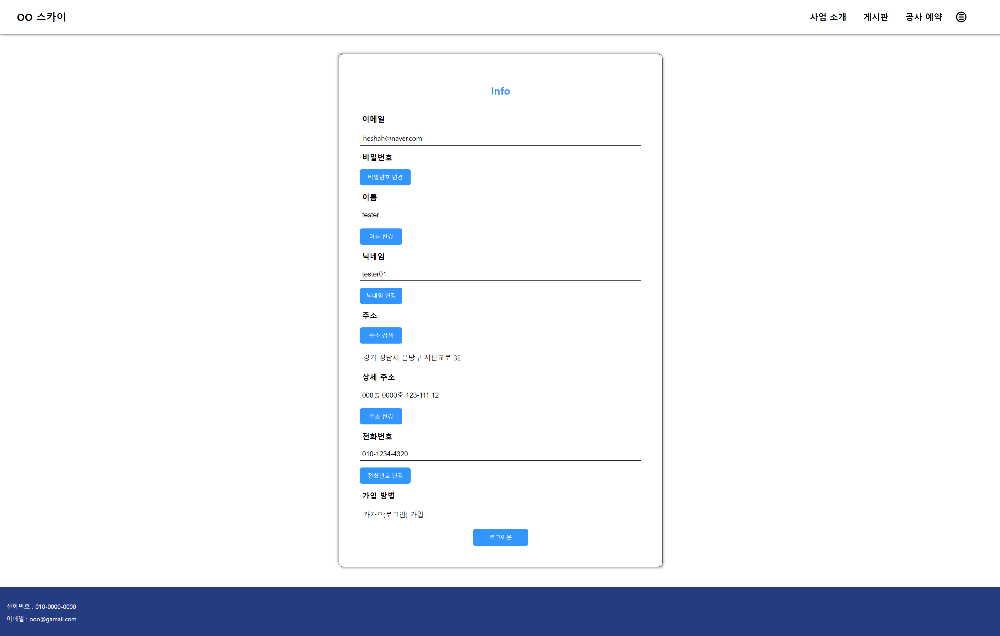
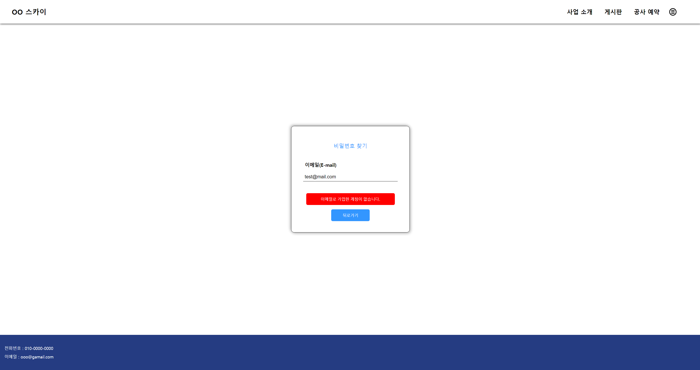
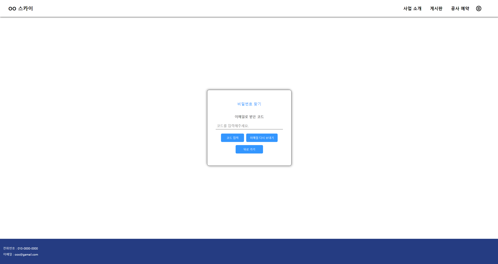

<h1>namweb</h1>

프로젝트 주제 : 건설장비 차량 스카이 작업 예약 사이트</p?

소개 : 리액트와 스프링을 기반으로 한 프로젝트입니다.

약 2달 간 공부한 리액트를 직접 사용해보고 여러 기능을 만들어보았습니다.

<h2>제작 기간</h2>

2023-02 ~

<h2>기술 스택</h2>

Java(Spring), React.js, Mysql, Mybatis, Html5, CSS

<h2>화면</h2>
<h3>메인 페이지</h3>

<h3>달력 예약 페이지</h3>

<h3>로그인</h3>

<h3>회원가입</h3>

<h3>회원가입 - 주소 찾기 API</h3>

<h3>내 정보</h3>

<h3>비밀번호 찾기</h3>

<h3>비밀번호 찾기 - 인증 코드</h3>

