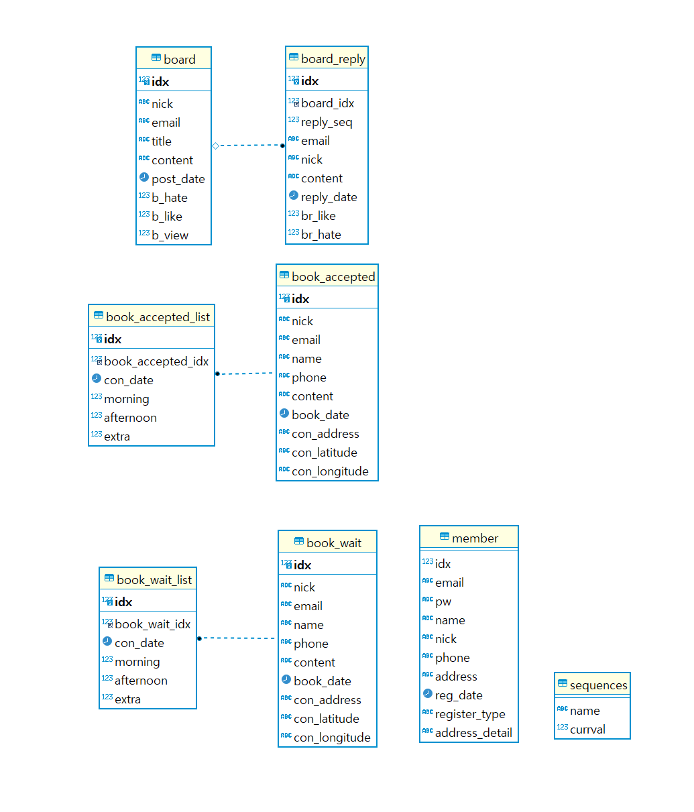
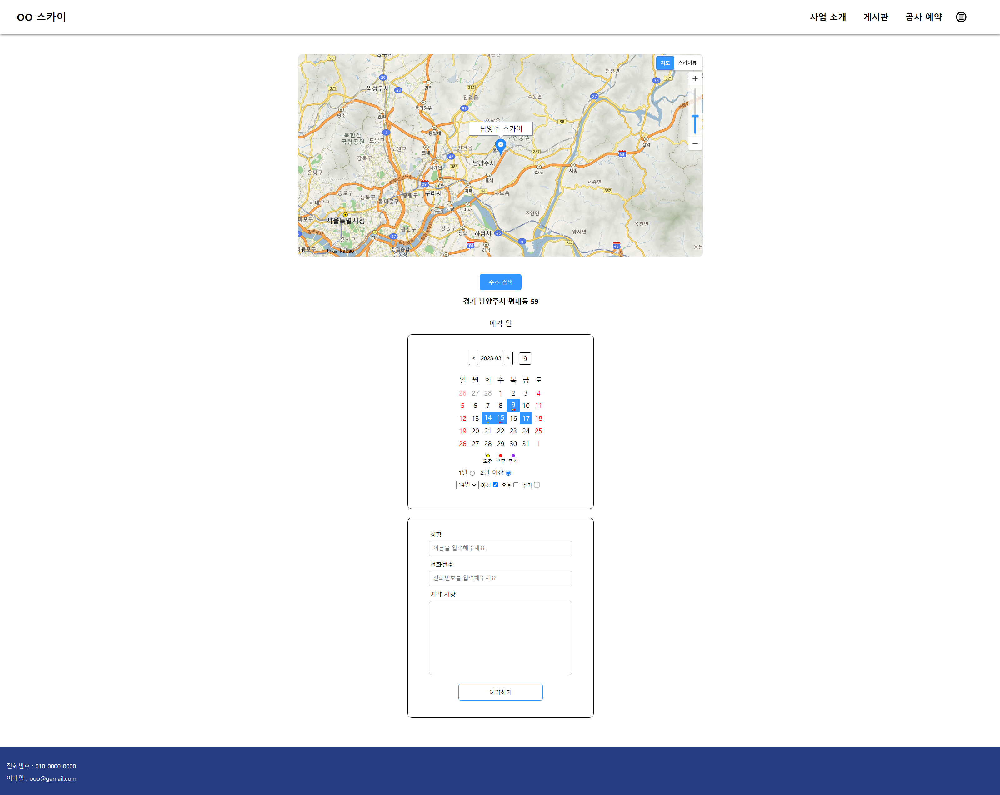
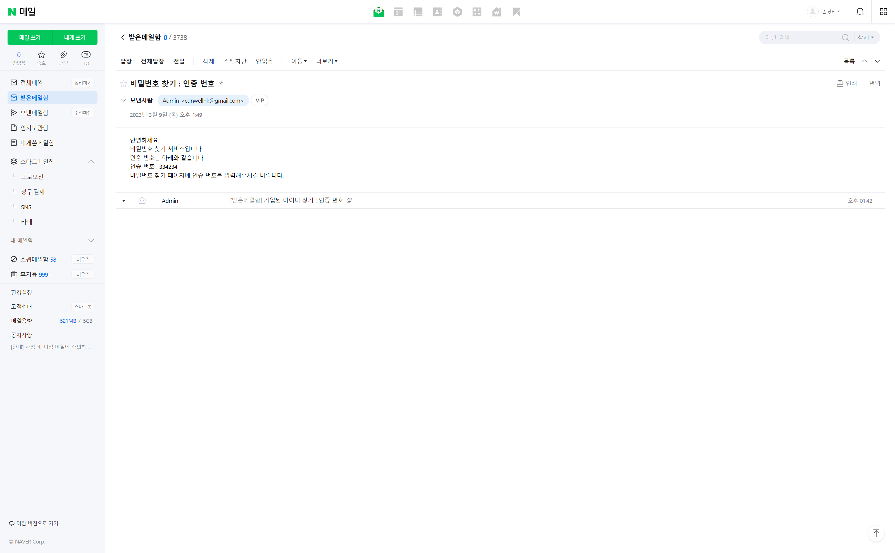
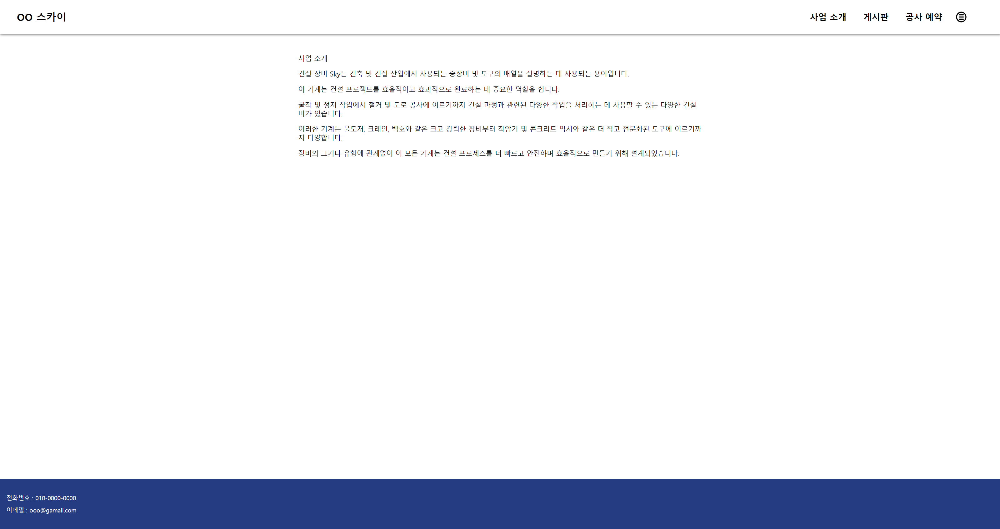
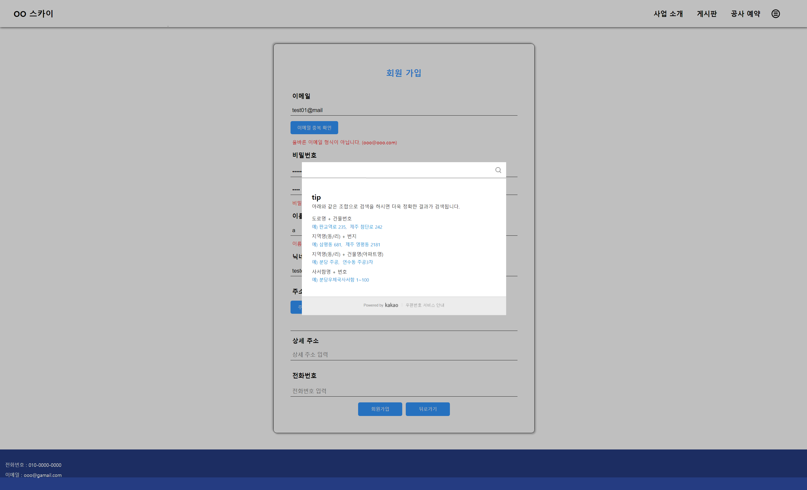

<h1>namweb</h1>

프로젝트 주제 : 건설장비 차량 스카이 작업 예약 사이트

소개 : 리액트와 스프링을 기반으로 한 프로젝트입니다.

약 2달 간 공부한 리액트와 타입스크립트를 사용해보고 여러 기능을 만들어보았습니다.

<h2>제작 기간</h2>

2023-02 ~

<h2>기술 스택</h2>

Java(Spring), React.js, Typescript, Mysql, Mybatis, Html5, CSS

<h2>ERD</h2>

<h2>핵심 기능</h2>
<h3>달력 컴포넌트</h3>

<h4>코드</h4>
<a href="https://github.com/cdnwell/Portfolio/blob/master/namweb/src/main/frontend/src/components/utility/Calendar.tsx">달력 컴포넌트 코드입니다</a>
<h3>이메일 전송 서비스</h3>

<h4>코드</h4>
<a href="https://github.com/cdnwell/Portfolio/blob/master/namweb/src/main/java/com/namweb/domain/google/email/sender/GoogleEmailSender.java">이메일 전송 코드입니다(자바)</a>
<h2>화면</h2>
<h3>메인 페이지</h3>

<h3>달력 예약 페이지</h3>

<h3>로그인</h3>

<h3>회원가입</h3>

<h3>회원가입 - 주소 찾기 API</h3>

<h3>내 정보</h3>

<h3>비밀번호 찾기</h3>

<h3>비밀번호 찾기 - 인증 코드</h3>

